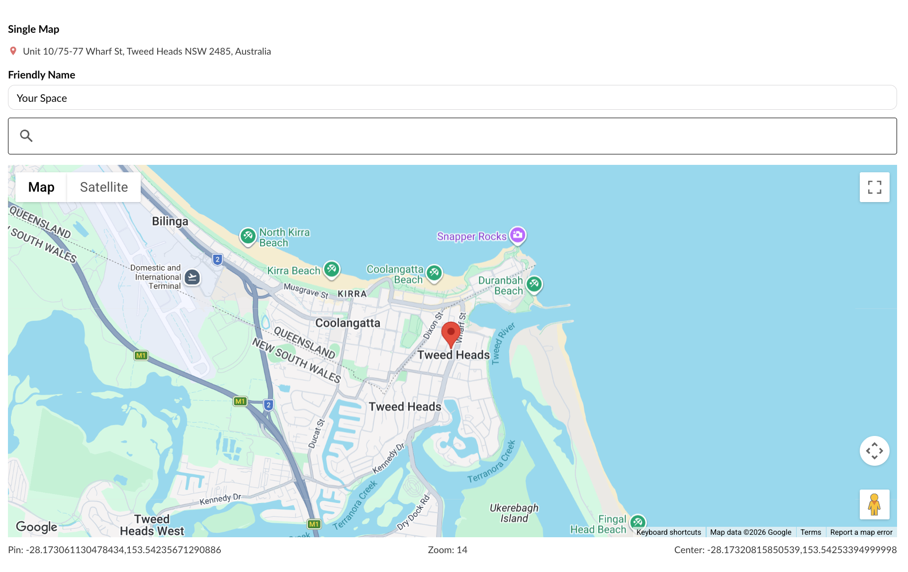
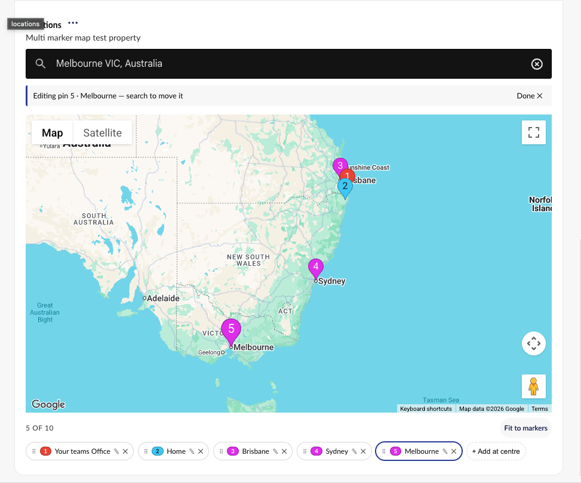

# Our.Umbraco.GMaps

Google Maps property editors for Umbraco, with property value converters, strongly-typed models
and UFM components.

The package ships two property editors:

| Property editor | What it holds |
| --------------- | ------------- |
| **Google Maps Single Marker** | One location: an address, a pin, and the map view it was set up in |
| **Google Maps Multi Marker** | Many pins on one shared map, each with its own name, description and colour |

Both are configured on a Data Type, both save the zoom, centre point and map type alongside the
address, and both read their API key from the Data Type or from `appsettings.json`.

## Documentation

| Page | Covers |
| ---- | ------ |
| [Installing & Configuring](Installing-&-Configuring.md) | Installing the package, getting a Google API key, and every Data Type setting for both editors |
| [Accessing & Working with Map Data](Accessing-&-Working-with-Map-Data.md) | The models a map property returns, reading them in Razor and in code, and the UFM components |
| [Rendering & Styling Maps on the front end](Rendering-&-Styling-Maps-on-the-front-end.md) | Turning a stored value into a map on your website, styled the way the editor set it up |
| [Troubleshooting](Troubleshooting.md) | What the notices above the map mean, and how to fix each one |
| [Supporting Umbraco 17 and Umbraco 18](multi-version-support.md) | How the repository builds one package flavour per Umbraco major |

## Supported Umbraco versions

| Umbraco | Package version |
| ------- | --------------- |
| 18      | `18.x`          |
| 17      | `17.x`          |
| 14 - 16 | `5.x`           |
| 10 - 13 | `3.0.5`         |

## Contributing

See [CONTRIBUTING.md](../CONTRIBUTING.md) for running the demo sites, the test suites, and the
conventions this project follows.
