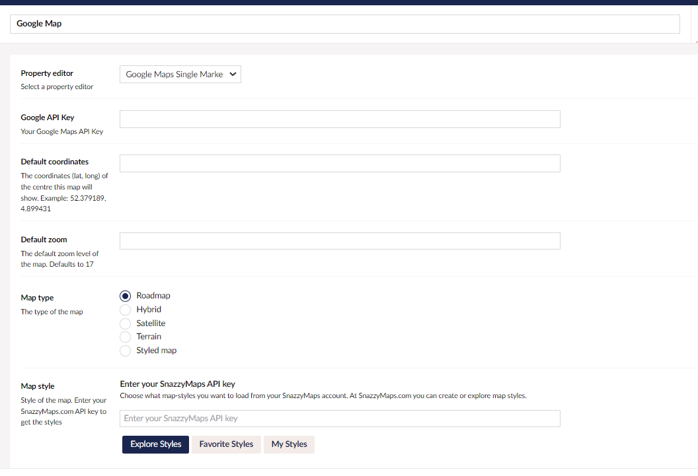

# Installing & Configuring # 


## Installing to Your Umbraco Site

### Umbraco 8
Use NuGet to install Our.Umbraco.GMaps:  
```powershell
Install-Package Our.Umbraco.GMaps
```
Add the following keys to your web.config AppSettings node:

```xml
	<!--Google Maps Configuration-->
	<add key="GoogleMaps:ApiKey" value="" /> <!-- Google Maps API Key -->
	<add key="GoogleMaps:DefaultLocation" value="" /> <!-- Coordinate pair in the format lat,lng -->
	<add key="GoogleMaps:DefaultZoom" value="17" /> <!-- Default Zoom Level for the Maps Property Editor. -->
```


### Umbraco 9
Use NuGet to install Our.Umbraco.GMaps:  
```powershell
Install-Package Our.Umbraco.GMaps
```
Add the following to your appsettings.json file or equivalent settings provider (Azure KeyVault, Environment, etc.):

```json
  "GoogleMaps": {
    "ApiKey": "",
    "DefaultLocation": "",
    "ZoomLevel": 17
  }
```

## Setting Up a Data Type 

In the Umbraco back-office, add a new Data Type using the **"Google Maps Single Marker"** Property Editor.


Values set here for **Google Api Key**, **Default Coordinates**, and **Default Zoom** will override the same values configured via web.config/AppSettings.json. 


## Property Mapping

The **Property mapping** setting lets a map exchange address data with other
properties on the same content item — or, when the map sits inside a Block List,
Block Grid or rich text block, with the other properties on that same block.

Pick a **Direction**:

| Direction | What happens |
| --- | --- |
| Off | Default. The map ignores other properties entirely. |
| Properties → Map | The mapped properties are geocoded and the pin follows them. |
| Map → Properties | Picking a place (or dragging the pin) writes the resolved components back out. |
| Both directions | Both of the above. |

Then add a row per field you want to exchange, choosing the map field and typing
the **alias** of the property it pairs with. Aliases are typed rather than picked
because a Data Type does not know which Document Types will end up using it. Any
alias that does not exist on the content is ignored, and a warning is shown on
the property itself.

### Properties → Map

If **Coordinates**, or both **Latitude** and **Longitude**, are mapped and hold a
valid location, the pin is placed directly and no geocoding request is made.
Otherwise the mapped text fields are combined into a single address and geocoded.
**Full address**, when mapped and non-empty, is used on its own.

Lookups never run when a document is opened, so an existing hand-placed pin is
never moved and simply opening a document never marks it dirty. Editors get a
**Look up from address fields** button on the property. Turning on **Look up
automatically** additionally geocodes whenever a mapped property changes — this
consumes Geocoding API quota, so it is off by default.

### Map → Properties

Writes happen when the editor picks a place, drags the pin, enters coordinates,
edits the friendly name, or resets the view. A value is only written when it
actually differs, so panning or zooming the map does not dirty the document, and
dragging the pin updates only the coordinates.

Latitude and Longitude are written as numbers, so they suit a numeric property.
To keep both in a single text property, map **Coordinates** instead — it is
written as `lat,lng`.

Data flowing in never immediately flows back out, so **Both directions** cannot
loop.

> Clearing the map with the *Clear Marker* property action does not clear the
> mapped properties.


## Getting a Google API Key

Login to/create an account at : https://console.cloud.google.com/home/

Enable the following Google Maps API on https://console.cloud.google.com/home/dashboard
- Maps Javascript API
- Geocoding API
- Places API (New)

In the Credentials area, create a new API Key which allows usage of those three APIs. 