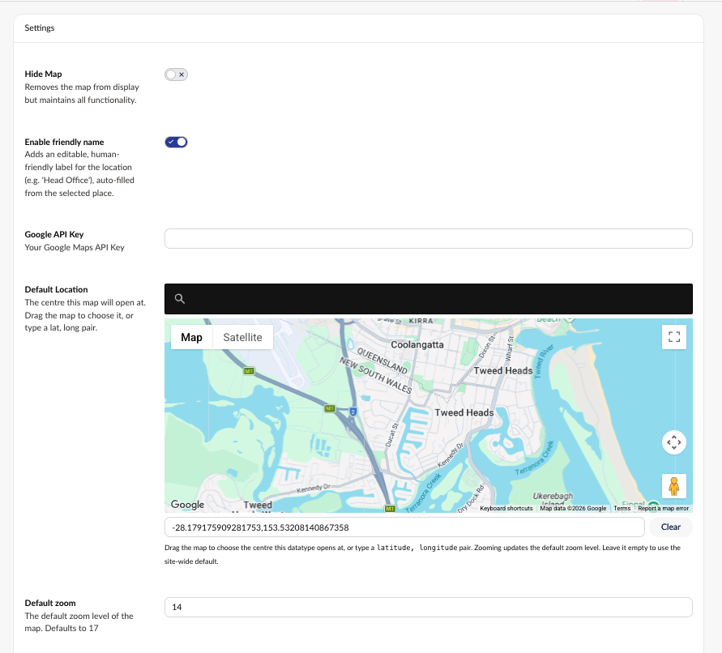
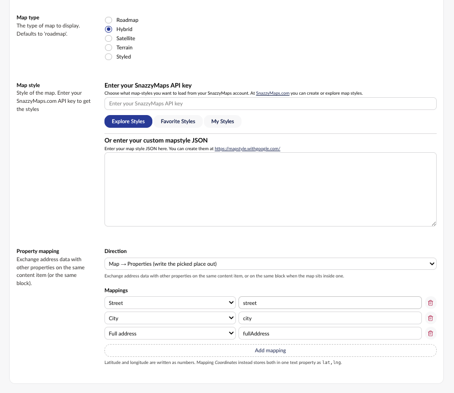
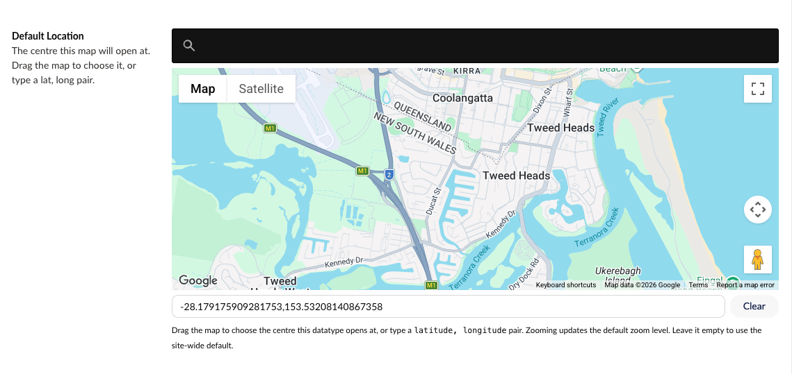
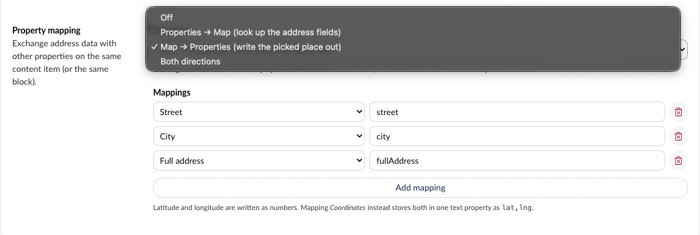
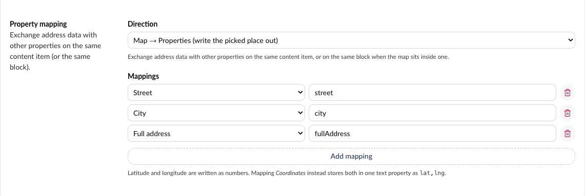

# Installing & Configuring

## Installing

Use NuGet to install Our.Umbraco.GMaps:

```powershell
Install-Package Our.Umbraco.GMaps
```

```bash
dotnet add package Our.Umbraco.GMaps
```

NuGet picks the flavour that matches the Umbraco version already installed, because each flavour
declares a bounded Umbraco dependency range:

| Umbraco | Package version |
| ------- | --------------- |
| 18      | `18.x`          |
| 17      | `17.x`          |
| 14 - 16 | `5.x`           |
| 10 - 13 | `3.0.5`         |

Umbraco 8 and 9 are not supported by any current release. See
[Supporting Umbraco 17 and Umbraco 18](multi-version-support.md) for how the flavours are built.

The package runs its own migrations on first boot. Alongside registering the package, they repair
map values written by older versions in shapes the current models cannot read — a `"lat, lng"`
string where a point is now expected, and a null zoom level. Only values that actually need it are
rewritten, so it is safe on content that is already correct.

## Getting a Google API Key

Log in to (or create) an account at <https://console.cloud.google.com/home/>, then enable these
three APIs on <https://console.cloud.google.com/home/dashboard>:

* **Maps JavaScript API** — draws the map in the backoffice and on your site
* **Geocoding API** — turns a typed address or coordinate pair into a location
* **Places API (New)** — powers the address autocomplete in the search box

In the Credentials area, create an API key that allows all three.

> The **Geocoding API** is a separate API from Maps JavaScript and Places. A key that renders the
> map perfectly well can still be refused for address lookups, which is what coordinate entry, the
> reverse lookup after dropping a pin, and the property mapping *Look up* button all use. The
> property editor reports the reason Google gave above the map — see [Troubleshooting](Troubleshooting.md).

If you restrict the key by HTTP referrer, remember to allow every hostname the backoffice is served
from, not just the public site.

## Site-wide configuration

Add the following to `appsettings.json`, or to any equivalent settings provider (user secrets,
environment variables, Azure Key Vault):

```json
  "GoogleMaps": {
    "ApiKey": "",
    "DefaultLocation": "",
    "ZoomLevel": 17
  }
```

| Setting | Purpose |
| ------- | ------- |
| `ApiKey` | The Google Maps API key used by every map that does not set its own |
| `DefaultLocation` | A `latitude,longitude` pair. The centre a map opens at when the Data Type has no default |
| `ZoomLevel` | The zoom level a map opens at when the Data Type has no default. Falls back to `17` |

Every one of these can be overridden per Data Type. Keeping the key here and leaving the Data Type
field empty is the simplest setup, and it is the one that scales — see
[One API key per page](#one-api-key-per-page) below.

## Setting up a Data Type

In the backoffice, create a Data Type using either the **Google Maps Single Marker** or the
**Google Maps Multi Marker** property editor.





### Settings both editors share

| Setting | Purpose |
| ------- | ------- |
| **Hide Map** | Removes the map from display but keeps all functionality. Useful when editors only need the address fields |
| **Google API Key** | Overrides `GoogleMaps:ApiKey` for this Data Type |
| **Default Location** | The centre this map opens at. Overrides `GoogleMaps:DefaultLocation` |
| **Default zoom** | The zoom level this map opens at. Overrides `GoogleMaps:ZoomLevel`. Defaults to `17` for Single Marker and `12` for Multi Marker |
| **Map type** | Roadmap, Hybrid, Satellite, Terrain or Styled. Defaults to Roadmap |
| **Map style** | A [SnazzyMaps](https://snazzymaps.com) style, or your own map style JSON |

### Settings only the Single Marker editor has

| Setting | Purpose |
| ------- | ------- |
| **Enable friendly name** | Adds an editable, human-friendly label for the location (for example *Head Office*), auto-filled from the selected place |
| **Property mapping** | Exchanges address data with other properties on the same content item or block. See [Property mapping](#property-mapping) |

### Settings only the Multi Marker editor has

| Setting | Purpose |
| ------- | ------- |
| **Enable description** | Adds a free-text description to each marker, for info windows and captions |
| **Minimum markers** | The fewest markers the property will accept. Leave empty for no minimum |
| **Maximum markers** | The most it will accept. `0` or empty means unlimited |
| **Marker colours** | The palette editors choose from. Leave empty to hide the colour control |

Minimum and maximum are enforced as property validation, so a document below the minimum or above
the maximum cannot be saved. A minimum greater than the maximum can never be satisfied, so rather
than trap editors in the property, both limits are ignored and the editor says the property is
misconfigured.

**Marker colours** is a colour swatch list, and each swatch has a label. That label travels through
to the front-end as `Marker.ColorLabel`, so name swatches for what they *mean* — `Retail`,
`Warehouse`, `Closed` — rather than for how they look. Only the hex value is stored against a
marker; the label is resolved when the value is read, so renaming a swatch updates every document
at once. See [Accessing & Working with Map Data](Accessing-&-Working-with-Map-Data.md#marker-colours).

### Default Location

**Default Location** is chosen on a map rather than typed.



* Drag the map to the centre this Data Type should open at, or search for a place by name
* A `latitude, longitude` pair can still be typed or pasted into the field below the map
* Zooming the map updates **Default zoom** to match
* **Clear** empties the field, falling back to `GoogleMaps:DefaultLocation`

The map needs an API key before it will render — either from the **Google API Key** field above it,
or from `appsettings.json`. Correcting a key in the field takes effect immediately, without
reloading the backoffice.

## One API key per page

The Google Maps JavaScript API is keyed **once per page**. Several map properties on one document
therefore cannot each load under their own key.

Rather than let whichever editor initialises first impose its key, every map on the page offers its
key and the best one wins: a key set on a Data Type beats the `GoogleMaps:ApiKey` fallback, and
within a rank the first offer wins. A map that does not get its own key says so, instead of drawing
a broken map:

> This page already loaded Google Maps with a different API key. The Maps API allows only one API
> key per page, so this map cannot use its own.

If a document carries more than one map property, either give them all the same key or — better —
leave the Data Type field empty on all of them and set one key in `GoogleMaps:ApiKey`.

## Property mapping

*Single Marker only.* Property mapping exchanges one address with one set of sibling properties,
which has no coherent meaning for a map of many pins.

A map property can exchange address data with other properties on the same content item — or, when
the map sits inside a Block List, Block Grid or rich text block, with the other properties on that
same block. It is off by default.



Pick a **Direction**:

| Direction | What happens |
| --------- | ------------ |
| Off | Default. The map ignores other properties entirely |
| Properties → Map | The mapped properties are geocoded and the pin follows them |
| Map → Properties | Picking a place, or dragging the pin, writes the resolved components back out |
| Both directions | Both of the above |

Then add a row per field you want to exchange, choosing the map field and typing the **alias** of
the property it pairs with.



Aliases are typed rather than picked because a Data Type does not know which Document Types will end
up using it. An alias that does not exist on the content is ignored, and a warning is shown on the
property itself.

### Mappable fields

| Field | Notes |
| ----- | ----- |
| Full address | The formatted address Google returned |
| Friendly name | Only meaningful when **Enable friendly name** is on |
| Street number | |
| Street | |
| Postal code | |
| City | |
| State / region | |
| Country | |
| Latitude | Written as a number — suits a numeric property |
| Longitude | Written as a number — suits a numeric property |
| Coordinates (lat,lng) | Both values in one text property, as `lat,lng` |

### Properties → Map

If **Coordinates**, or both **Latitude** and **Longitude**, are mapped and hold a valid location,
the pin is placed directly and no geocoding request is made. Otherwise the mapped text fields are
combined into a single address and geocoded; **Full address**, when mapped and non-empty, is used on
its own.

Lookups never run when a document is opened, so an existing hand-placed pin is never moved and
opening a document never marks it dirty. Editors get a **Look up from address fields** button on the
property.

**Look up automatically** additionally geocodes whenever a mapped property changes. That consumes
Geocoding API quota on every keystroke-settled edit, so it is off by default.

### Map → Properties

Values are written when the editor picks a place, drags the pin, types coordinates, edits the
friendly name, or resets the view. A value is only written when it actually differs, so panning or
zooming the map does not mark the document dirty, and dragging the pin updates only the coordinates.

Data flowing in never immediately flows back out, so **Both directions** cannot loop.

> Clearing the map with the *Clear Marker* property action does not clear the mapped properties.

## Using the editors

### Single Marker


* Search for an address in the box above the map — Places autocomplete suggests as you type
* Or paste a `latitude, longitude` pair into the same box
* Or click anywhere on the map to drop the pin there
* Drag the pin to fine-tune it
* Hold **ctrl** and drag to pan the map (so scrolling a long document does not zoom the map)
* With **Enable friendly name** on, a *Location name* field appears, pre-filled from the picked place

The resolved address is shown above the property, and a readout under the map gives the three values
that are saved with the value: **Pin** (the marker's coordinates), **Zoom**, and **Center** (the map
centre, which is deliberately allowed to differ from the pin).

Two property actions are available from the **…** menu once the property has a value:

| Action | Effect |
| ------ | ------ |
| **Reset Map View** | Returns the map to the saved centre, zoom and pin |
| **Clear Marker** | Removes the stored value entirely |

### Multi Marker


The map is the primary surface:

* Search or click the map to drop a pin
* **+ Add at centre** adds one at the current map centre
* Drag pins to move them, and drag the chips underneath to reorder
* **Fit to markers** zooms the map to show every pin
* The ✎ on a chip opens a right-hand drawer with that marker's friendly name, description and
  colour, so the map stays visible while you edit
* The ✕ on a chip removes that marker

Clicking a pin or a chip **selects** it. The search box fills with that marker's address, and
searching then moves the selected pin rather than adding another — so an existing marker can be
relocated by address. A name you gave the marker is kept. Click it again, or **Done**, to go back to
adding.

Each pin is numbered by its position in the list and painted in its own colour, and its chip carries
the same number and colour, so a pin on the map and a row in the list are the same thing at a
glance. Reordering or removing a marker renumbers the rest. When a maximum is configured, the count
above the chips reads `3 of 10`.

Two property actions are available from the **…** menu:

| Action | Effect |
| ------ | ------ |
| **Reset Map View** | Returns the map to the saved centre and zoom |
| **Clear all markers** | Removes every marker |

### Switching an existing Single Marker property to Multi

Changing the Data Type over does not lose the pin: the Multi converter reads a stored single-map
value as a one-marker list. The value is rewritten in the multi shape the next time an editor saves
the document.
